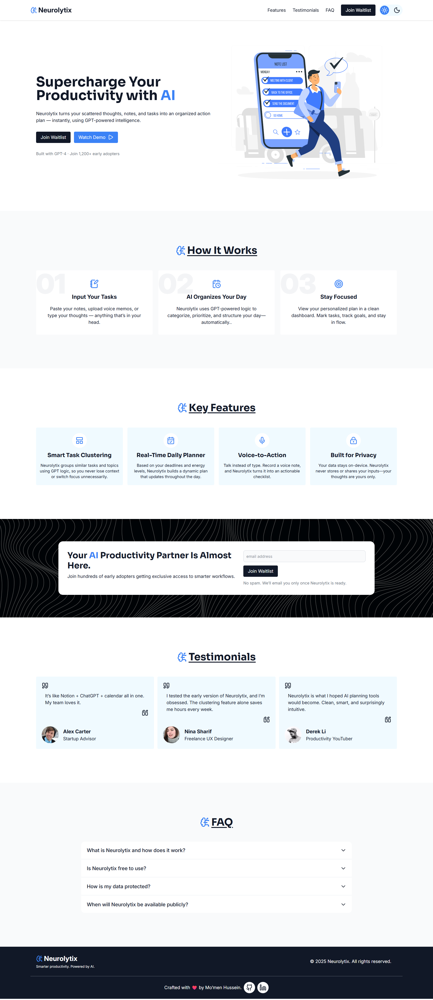
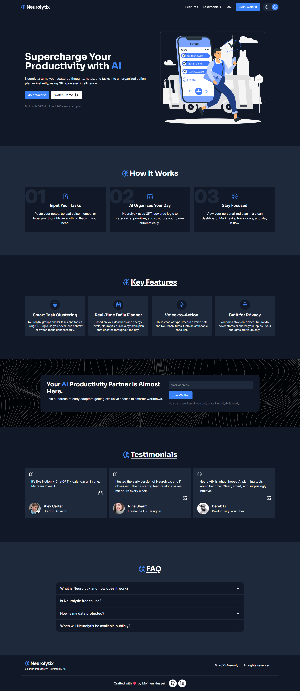

# 🧠 Neurolytix — AI Startup Landing Page

Neurolytix is a modern, responsive, and dark-mode-enabled landing page crafted for a fictional AI startup. This project demonstrates strong skills in semantic HTML, utility-first CSS with Tailwind CLI, responsive layouts, and UI/UX best practices. It's designed to showcase clean structure, accessibility, and design polish — perfect for clients looking for professional landing pages.

---

## 🚀 Live Preview

🔗 [Live Demo](https://your-live-link.com)

---

## 📌 Features

- ✅ Responsive Design (Mobile-first)
- 🌙 Dark Mode Support (using Tailwind’s dark variant)
- 🎯 Clean and Semantic HTML
- 🎨 Tailwind CSS (via CLI build)
- 📚 Sections:
  - Navigation Bar
  - Hero Section
  - Features
  - About Us
  - Testimonials
  - FAQ
  - Call-to-Action
  - Footer
- 💡 Lucide Icons used for consistent visual identity
- 🧪 Modern CSS Variables for theming (`--color-primary`, etc.)

---

## 🛠️ Built With

- **HTML5**
- **Tailwind CSS** (installed via CLI)
- **Lucide Icons** (via CDN)

---

## 🧩 Folder Structure

Neurolytix/
├── index.html
├── css/
│ └── input.css
│ └── style.css
├── img/
│ └── cta.jpg, hero-section.svg
├── js/
│ └── main.js

---

## 📷 Screenshots

| Light Mode | Dark Mode |
|------------|-----------|
|  |  |

---

## 🤝 Designed By

**Mo’men Hussein** — Front-End Developer
📬 [LinkedIn](https://www.linkedin.com/in/momen5406) | [GitHub](https://github.com/momen5406)

---